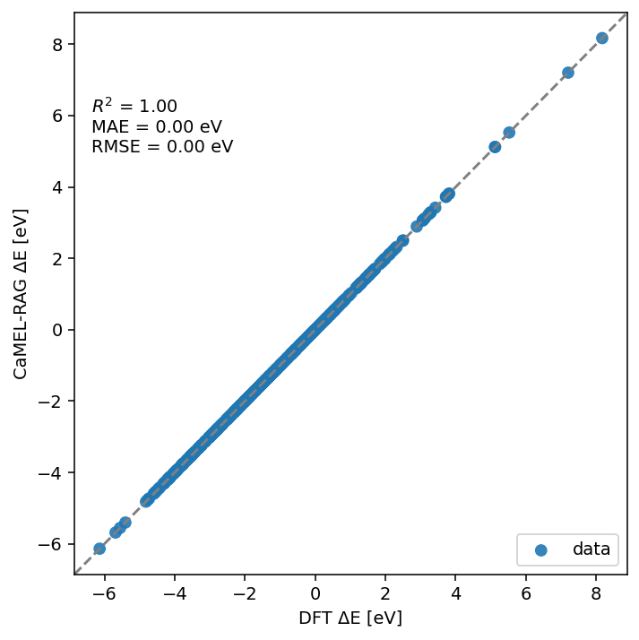

# CaMEL-RAG

A lightweight **Retrieval-Augmented Generation (RAG)** framework built in Python. This framework has been developed for the `2025 LLM Hackathon for Applications in Materials Science & Chemistry` by the team `code4catlysis-KFUPM`.
It uses a CSV file of domain documents, creates a vector store (`FAISS` + `Sentence-Transformers` embeddings) stored under the `doc/` folder, and answers natural language questions by retrieving relevant chunks and passing them as context to an **OpenAI LLM**.

---

## Repository Structure
```
├── CaMEL-RAG.ipynb # Main notebook (build, query, and test RAG pipeline)
├── doc/ # Stores FAISS index, embeddings, ids, metadata, config
│ ├── index.faiss
│ ├── embeddings.npy
│ ├── doc_ids.json
│ ├── metadata.json
│ └── build_config.json
└── README.md
```

---

##  Features
- **Vector Store:** Creates a FAISS index from text chunks in a CSV column (default: `descriptor`).
- **Embeddings:** Uses `sentence-transformers/all-MiniLM-L6-v2` by default (can be swapped).
- **RAG Querying:** Retrieves top-*k* similar chunks from the vector store.
- **LLM Backend:** Calls the **OpenAI Chat API** (`gpt-4.1-mini` by default) for grounded answer generation.
- **Context Injection:** Builds prompts that cite sources with `[#doc_id]` tags.
- **Evaluation Ready:** Easy to test with seen/unseen queries.
---
## Performance

In this framework, we hace used `gpt-4.1-mini` as the deafualt LLM. Any model can be used to generate the response based on the given query and the context retrieved from the vector. </br>
With the default model, we have achieved a near perfect result. </br>

---



---
## ⚙️ Setup

### 1. Clone the repository
```bash
git clone https://github.com/your-username/CaMEL-RAG.git
cd CaMEL-RAG
```

### 2. Install Dependencies
```bash
pip install -U pandas sentence-transformers faiss-cpu openai tqdm python-dotenv
```

### 3. Set your OpenAI API key
``` bash
export OPENAI_API_KEY="sk-..."    # macOS/Linux
# OR
setx OPENAI_API_KEY "sk-..."      # Windows PowerShell
```

### 4. (Optional) Authenticate with Hugging Face

```bash
pip install huggingface_hub
huggingface-cli login
```


